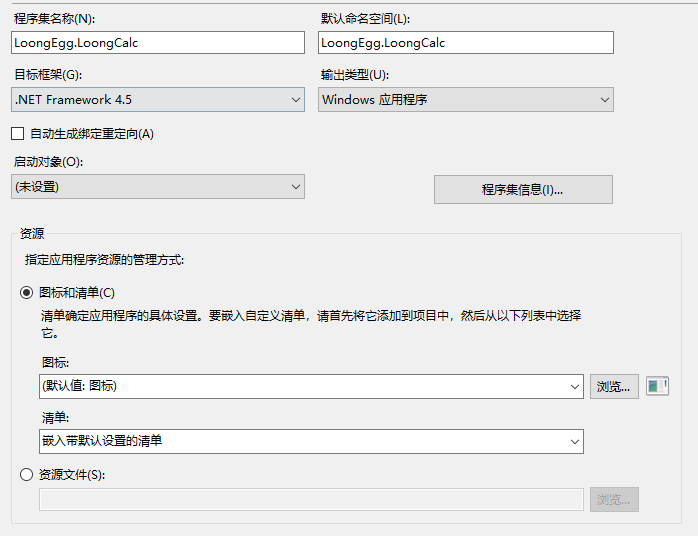

# LoongCalc

## 21-项目结构

- ```LoongEgg.LoongCalc```是一个控制台程序用来启动整个项目
- ```LoongEgg.ViewModels```是一个类库，用来放ViewModel
- ```LoongEgg.ViewModels.Test```是ViewModel的单元测试项目
- ```LoongEgg.Views```用来放View，也就是各种窗体和控件
## 22-如何在VS中生成MarkDown文件
- ```MarkdownEditor Editor```需要安装这个插件
- 插入图片时名字有空格或者特殊字符可能出错

## 23-圆角无边框窗体移动、在控制台启动WPF、不显示控制台窗体
1. 窗体无边框设置
```xml
    Width="360"
    Height="500"
    AllowsTransparency="True" 允许透明后彻底无边框
    Background="#FFB4D2EC"
    WindowStartupLocation="CenterScreen" 启动后出现在屏幕中间
    WindowStyle="None" 无边框
    MouseLeftButtonDown="Window_MouseLeftButtonDown" 鼠标左键按压时的处理事件，用来移动窗口
```

2. 圆角切割
```xml
<Window.Clip>
        <RectangleGeometry
            RadiusX="30"
            RadiusY="30"
            Rect="0,0, 360, 500" />
</Window.Clip>
```

3. 窗体移动的后台代码
```c#
private void Window_MouseLeftButtonDown(object sender, MouseButtonEventArgs e) {
            DragMove();
        }
```

4. 增加程序集引用 
-   PresentationCore
-   PresentationFramework
-   System.Window
-   System.Window.Presentation
-   WindowsBase

5. 增加Using
```c#
using LoongEgg.Views;
using System.Windows;
```

6. 在控制台中启动WPF窗体
```c#
namespace LoongEgg.LoongCalc
{
    class Program
    {
        // TODO: 23-6 在控制台中启动WPF窗体
        [STAThread] // 不要忘了这个标注
        static void Main(string[] args) {
            CalculatorView view = new CalculatorView();

            Application app = new Application();

            app.Run(view);

        }
    }
}

```

7. 不显示控制台窗体的方法
输出类型设置为```Windows应用程序```   



## 24-在程序集正确引用资源
**尽量用绝对路径**
1. 在新建的``Themes\Fonts.xaml``资源字典引用外部自定义字体  
``LoongEgg.Views``为程序集的名称  
``application``和``component``为标准用法，不要去动    
``/Assets/``为到资源的文件夹路径
```xml
<!--  使用自定义字体 #后面的字体名字请在资源管理器打开你的字体文件找到名字填进去  -->
    <FontFamily x:Key="Fonts.Icon">pack://application:,,,/LoongEgg.Views;component/Assets/#Font Awesome 5 Free Solid</FontFamily>
```
2. 将特定的图标“字”设置为静态资源 
``system:String``来源于引用的名称空间``xmlns:system="clr-namespace:System;assembly=mscorlib"``
```xml
<!--  定义一个图标“字”的静态资源  -->
    <system:String x:Key="Icons.PowerOff">&#xf011;</system:String>
```
3. 为了方便使用，应该把所有资源集合到自定义控件库的``Themes\Generic.xaml``
```xml
<ResourceDictionary
    xmlns="http://schemas.microsoft.com/winfx/2006/xaml/presentation"
    xmlns:x="http://schemas.microsoft.com/winfx/2006/xaml"
    xmlns:local="clr-namespace:LoongEgg.Views">

    <ResourceDictionary.MergedDictionaries>

        <!--  在这里组装各种资源  -->
        <ResourceDictionary Source="/LoongEgg.Views;component/Themes/Fonts.xaml" />
    </ResourceDictionary.MergedDictionaries>

</ResourceDictionary>

```
4. 在窗体引用资源
```xml
<Window
    x:Class="LoongEgg.Views.CalculatorView"
    xmlns="http://schemas.microsoft.com/winfx/2006/xaml/presentation"
    xmlns:x="http://schemas.microsoft.com/winfx/2006/xaml"
    xmlns:d="http://schemas.microsoft.com/expression/blend/2008"
    xmlns:local="clr-namespace:LoongEgg.Views"
    xmlns:mc="http://schemas.openxmlformats.org/markup-compatibility/2006"
    Title="CalculatorView"
    Width="360"
    Height="500"
    AllowsTransparency="True"
    Background="#FFB4D2EC"
    MouseLeftButtonDown="Window_MouseLeftButtonDown"
    WindowStartupLocation="CenterScreen"
    WindowStyle="None"
    mc:Ignorable="d">

    <Window.Resources>
        <ResourceDictionary>
            <ResourceDictionary.MergedDictionaries>
                <!--  因为所有资源都被集合到Generic.xaml，所以只需要引用它  -->
                <ResourceDictionary Source="/LoongEgg.Views;component/Themes/Generic.xaml" />
            </ResourceDictionary.MergedDictionaries>
        </ResourceDictionary>
    </Window.Resources>

    <!--  切割圆角  -->
    <Window.Clip>
        <RectangleGeometry
            RadiusX="30"
            RadiusY="30"
            Rect="0,0, 360, 500" />
    </Window.Clip>

    <Grid>
        <!--  字体和“字”都被定义到了静态资源，更易使用  -->
        <Button
            Content="{StaticResource Icons.PowerOff}"
            FontFamily="{StaticResource Fonts.Icon}"
            FontSize="56" />
    </Grid>
</Window>

```

## 25-Blend中立体感按钮拟态化WPF样式设计

- 立体感的实现是用了两个叠在一起的图形，一个使用亮色阴影一个暗色阴影营造的
- 可以将自定义图形生成Button时额外包一个ViewBox实现尺寸的自适应
```xml
<Window
    x:Class="LoongEgg.Views.CalculatorView"
    xmlns="http://schemas.microsoft.com/winfx/2006/xaml/presentation"
    xmlns:x="http://schemas.microsoft.com/winfx/2006/xaml"
    xmlns:d="http://schemas.microsoft.com/expression/blend/2008"
    xmlns:local="clr-namespace:LoongEgg.Views"
    xmlns:mc="http://schemas.openxmlformats.org/markup-compatibility/2006"
    Title="CalculatorView"
    Width="360"
    Height="500"
    AllowsTransparency="True"
    Background="#FFB4D2EC"
    MouseLeftButtonDown="Window_MouseLeftButtonDown"
    WindowStartupLocation="CenterScreen"
    WindowStyle="None"
    mc:Ignorable="d">

    <Window.Resources>
        <ResourceDictionary>
            <ResourceDictionary.MergedDictionaries>
                <!--  因为所有资源都被集合到Generic.xaml，所以只需要引用它  -->
                <ResourceDictionary Source="/LoongEgg.Views;component/Themes/Generic.xaml" />
            </ResourceDictionary.MergedDictionaries>

            <!--  关机键  -->
            <Style x:Key="ButtonStyles.PowerOff" TargetType="{x:Type Button}">
                <Setter Property="Template">
                    <Setter.Value>
                        <ControlTemplate TargetType="{x:Type Button}">
                            <!--  额外包了一层ViewBox实现控件的自适应缩放  -->
                            <Viewbox>
                                <Grid>
                                    <Grid>
                                        <Ellipse
                                            Width="80"
                                            Height="80"
                                            Margin="5"
                                            HorizontalAlignment="Center"
                                            Fill="#FFB4D2EC">
                                            <Ellipse.Effect>
                                                <DropShadowEffect />
                                            </Ellipse.Effect>
                                        </Ellipse>
                                        <Ellipse
                                            Width="80"
                                            Height="80"
                                            Margin="5"
                                            HorizontalAlignment="Center"
                                            Fill="#FFB4D2EC">
                                            <Ellipse.Effect>
                                                <DropShadowEffect Direction="135" Color="#FFF4FAFF" />
                                            </Ellipse.Effect>
                                        </Ellipse>
                                    </Grid>
                                    <ContentPresenter
                                        HorizontalAlignment="{TemplateBinding HorizontalContentAlignment}"
                                        VerticalAlignment="{TemplateBinding VerticalContentAlignment}"
                                        RecognizesAccessKey="True"
                                        SnapsToDevicePixels="{TemplateBinding SnapsToDevicePixels}" />
                                </Grid>
                            </Viewbox>
                            <ControlTemplate.Triggers>
                                <Trigger Property="IsFocused" Value="True" />
                                <Trigger Property="IsDefaulted" Value="True" />
                                <Trigger Property="IsMouseOver" Value="True" />
                                <Trigger Property="IsPressed" Value="True" />
                                <Trigger Property="IsEnabled" Value="False" />
                            </ControlTemplate.Triggers>
                        </ControlTemplate>
                    </Setter.Value>
                </Setter>
            </Style>
        </ResourceDictionary>
    </Window.Resources>

    <!--  切割圆角  -->
    <Window.Clip>
        <RectangleGeometry
            RadiusX="30"
            RadiusY="30"
            Rect="0,0, 360, 500" />
    </Window.Clip>

    <Grid>
        <StackPanel VerticalAlignment="Center">
            <!--  字体和“字”都被定义到了静态资源，更易使用  -->
            <!--  关机键  -->
            <Button
                x:Name="button"
                Width="130"
                Height="130"
                Content="{StaticResource Icons.PowerOff}"
                FontFamily="{StaticResource Fonts.Icon}"
                FontSize="50"
                Foreground="Chocolate"
                Style="{DynamicResource ButtonStyles.PowerOff}" />

        </StackPanel>
    </Grid>
</Window>

```
## 26-WPF控件仿液晶屏拟态三维效果
```xml
<!--  下陷立体感液晶屏  -->
            <Grid Height="120" Margin="20,0,20,0">
                <Grid.Clip>
                    <RectangleGeometry
                        RadiusX="12"
                        RadiusY="12"
                        Rect="0,0, 320, 120" />
                </Grid.Clip>
                <Rectangle Fill="White" Opacity="0.5" />
                <Canvas x:Name="canvas">
                    <Path
                        Width="{Binding ElementName=canvas, Path=ActualWidth}"
                        Height="{Binding ElementName=canvas, Path=ActualHeight}"
                        Fill="Black"
                        Opacity="0.5">
                        <Path.Data>M0,0 L320,0  L300,20 L20,100  L0,120</Path.Data>
                    </Path>
                </Canvas>
                <Rectangle
                    Margin="10"
                    Fill="#FF343434"
                    RadiusX="9"
                    RadiusY="9" />
            </Grid>
```
## 27-ToggleButton和Button的动画样式
- 在Blend中可以图形化设计和预览
- 
## 28-用UniformGrid快速完成布局
- 比Grid方便在于不用定义Grid.Row和Grid.Column,依次放进去进好
- 如果要空掉某个位置，放一个控件进去，然后Visibility=Hidden就

# C#编程高级入门，数学表达式解析与计算
## 29-逆波兰表达式与TokenType, 新建类库
- 逆波兰表达式
```c#
    /// 中缀表达式   2 + 3 * (4 -5)
    /// 逆波兰表达式 [2][3][4][5][-][*][+]
```
- TokenType.cs
```c#
    /// <summary>
    /// Token的类型枚举
    /// </summary>
    public enum TokenType
    {
        /// <summary>
        /// 运算符：+ - * / ^
        /// </summary>
        Operator,

        /// <summary>
        /// 函  数：cos sin etc..
        /// </summary>
        Function,

        /// <summary>
        /// 操作数：.0123456789
        /// </summary>
        Operand,
         
        /// <summary>
        /// 左括号：(
        /// </summary>
        LeftBracket,

        /// <summary>
        ///  右括号：)
        /// </summary>
        RightBracket,
    }
```
## 30-char的扩展方法字符类型检查和单元测试
1. char的扩展方法
> https://docs.microsoft.com/zh-cn/dotnet/csharp/programming-guide/classes-and-structs/extension-methods   

```c#
using System.Linq;

/* 
 | 个人微信：InnerGeeker
 | 联系邮箱：LoongEgg@163.com 
 | 创建时间：2020/4/19 20:21:51
 | 主要用途：
 | 更改记录：
 |			 时间		版本		更改
 */
namespace LoongEgg.MathPro
{
    // TODO: 29-1 字符的扩展方法-类型判断
    /// <summary>
    /// 字符的扩展方法
    /// </summary>
    public static class CharExtensions
    {
        /// <summary>
        /// 是操作符? +-*/^
        /// </summary>
        /// <param name="self"></param>
        /// <returns></returns>
        public static bool IsOperator(this char self) => "+-*/^".Contains(self);

        /// <summary>
        /// 是操作数？ 0~9或.
        /// </summary>
        /// <param name="self"></param>
        /// <returns></returns>
        public static bool IsDigit(this char self) => ".0123456789".Contains(self);

        /// <summary>
        /// 是字母？
        /// </summary>
        /// <param name="self"></param>
        /// <returns></returns>
        public static bool IsLetter(this char self) => (self >= 'a' && self <= 'z') || (self >= 'A' && self <= 'Z');

        /// <summary>
        /// 是左括号？
        /// </summary>
        /// <param name="self"></param>
        /// <returns></returns>
        public static bool IsLeftBracket(this char self) => '(' == self;

        /// <summary>
        /// 是右括号？
        /// </summary>
        /// <param name="self"></param>
        /// <returns></returns>
        public static bool IsRightBracket(this char self) => ')' == self;
    }
}

```

2. CharExtensions的单元测试
```c#
[TestClass]
    public class CharExtensions_Test
    {
        [TestMethod]
        public void IsOperator() {
            Assert.IsTrue('+'.IsOperator());
            Assert.IsTrue('-'.IsOperator());
            Assert.IsTrue('*'.IsOperator());
            Assert.IsTrue('/'.IsOperator());
            Assert.IsTrue('^'.IsOperator());
        }
         
        [TestMethod]
        public void IsDigit() {
            Assert.IsTrue('.'.IsDigit());
            Assert.IsTrue('0'.IsDigit());
            Assert.IsTrue('9'.IsDigit()); 
        }

        [TestMethod]
        public void IsLetter() {
            Assert.IsTrue('A'.IsLetter()); 
            Assert.IsTrue('a'.IsLetter()); 
            Assert.IsTrue('Z'.IsLetter()); 
            Assert.IsTrue('z'.IsLetter()); 
        }

        [TestMethod]
        public void IsBracket() {
            Assert.IsTrue('('.IsLeftBracket()); 
            Assert.IsTrue(')'.IsRightBracket());  
        }
    }
```
## 31-词元优先级、类型判断，[partial]分布类

1. 词元的基本属性， [partial]分部类
```c#
/* 
 | 个人微信：InnerGeeker
 | 联系邮箱：LoongEgg@163.com 
 | 创建时间：2020/4/19 21:42:45
 | 主要用途：Token的分部类 > 属性和构造器
 | 更改记录：
 |			 时间		版本		更改
 */
using System;

namespace LoongEgg.MathPro
{
    // TODO: 31-1 词元的基本属性， [partial]分部类
    /// <summary>
    /// 数学表达式的词元
    /// </summary>
    public partial class Token
    {
        /*-------------------------------------- Properties -------------------------------------*/
        /// <summary>
        /// 词元的类型
        /// </summary>
        public TokenType Type { get; private set; }

        /// <summary>
        /// 将原字符串全部.ToLower()
        /// </summary>
        public string NormalizeString { get; private set; }

        /// <summary>
        /// 运算的优先级
        /// </summary>
        public int Priority { get; private set; } = -1;

        /*------------------------------------- Constructors ------------------------------------*/
        /// <summary>
        /// 主构造器
        /// </summary>
        /// <param name="token"></param>
        public Token(string token) {
            this.NormalizeString = token.ToLower();
            this.Type = GetTokenType(token);
            this.Priority = GetTokenPriority(Type, NormalizeString);
        }

        public Token(char token) : this(token.ToString()) { }
    }
}

```

2. 类型获取
```c#
using System;

/* 
 | 个人微信：InnerGeeker
 | 联系邮箱：LoongEgg@163.com 
 | 创建时间：2020/4/19 21:46:58
 | 主要用途：Token的分部类 > 公共静态方法
 | 更改记录：
 |			 时间		版本		更改
 */
namespace LoongEgg.MathPro
{
    
    public partial class Token
    { 
        /*------------------------------------ Public Methods -----------------------------------*/
        // TODO: 31-2 类型判断
        /// <summary>
        /// 获取Token的类型
        /// </summary> 
        public static TokenType GetTokenType(char c) {
            if (c.IsDigit()) {
                if (c == '.') throw new ArgumentException("<.>不能独立成为操作数");
                return TokenType.Operand;
            }
            else if (c.IsOperator()) {
                return TokenType.Operator;
            }
            else if (c.IsLeftBracket()) {
                return TokenType.LeftBracket;
            }else if (c.IsRightBracket()) {
                return TokenType.RightBracket;
            }
            else {
                throw new ArgumentException($"{c} 不合适的TokenType");
            }
        }

        /// <summary>
        /// 获取Token的类型
        /// </summary> 
        public static TokenType GetTokenType(string token) {
            if (token == null)
                throw new ArgumentNullException("token");

            // 一个字符长度
            if (token.Length == 1) {
                return GetTokenType(token[0]);
            }
            else {
                // 操作数
                if(double.TryParse(token, out double d)) {
                    return TokenType.Operand;
                }
                else { // 函数
                    return TokenType.Function;
                }
            }
        } 
       
    }
}

```

3. 优先级获取
```c#
        // TODO: 31-3 优先级
        /// <summary>
        /// token的运算级别
        /// </summary>
        /// <param name="type">token的类型</param>
        /// <param name="token">ToLower后的token字符串</param>
        /// <returns>运算级数字别大的优先</returns>
        public static int GetTokenPriority(TokenType type, string token) {

            int priority = -1;

            switch (type) {
                case TokenType.Operator: {
                        if ("+-".Contains(token))
                            priority = 1;
                        else if ("*/".Contains(token))
                            priority = 2;
                        else if (token == "^")
                            priority = 3;
                        else
                            throw new Exception($"Unknow math operator: {token}");
                    }
                    break;

                case TokenType.Function:
                    priority = 4;
                    break;

                case TokenType.Operand: 
                case TokenType.LeftBracket: 
                case TokenType.RightBracket:
                    priority = -1;
                    break;
            }

            return priority;
        }
```
## 32-[C#]数学表达式的解析转译，单元测试的调试
1. 转译字符串到Token, 重写ToString()，String的方法扩展 
```Token.cs```
```c#
 // TODO: 32-1 转译字符串到Token
        /// <summary>
        /// 将字符串转译成<see cref="Token"/>的集合
        /// </summary>
        /// <param name="inp">待转译的字符串</param>
        /// <returns></returns>
        public static List<Token> Tokenize(string inp) {
            var ret = new List<Token>();
            var str = inp.RemoveSpace(); // 即str.Replace(" ", string.Empty);

            int i = 0;
            int cnt = str.Length;
            char c;
            StringBuilder token = new StringBuilder();
            while (i < cnt) {
                c = str[i];
                token = new StringBuilder(c.ToString()); 

                if (c.IsDigit()) { // 如果是数字
                    while (i + 1 < cnt && str[i+1].IsDigit()) {
                        token.Append(str[i + 1]);
                        i += 1;
                    }
                }else if (c.IsLetter()) { // 如果是字母
                     while (i + 1 < cnt && str[i+1].IsLetter()) {
                        token.Append(str[i + 1]);
                        i += 1;
                    }
                }else if (c.IsOperator()) {// 如果字符串或者左括号后面的第一个字符是负号 
                    if (c == '-' && (i == 0 || (i > 0 && str[i - 1].IsLeftBracket()))) {
                        while (i + 1 < cnt && str[i + 1].IsDigit()) {
                            token.Append(str[i + 1]);
                            i += 1;
                        }
                    }
                }else if( c.IsLeftBracket() || c.IsRightBracket()) {
                    // do nothing
                }
                else {
                    throw new ArgumentException($"Undefine char : {c}");
                }

                ret.Add(new Token(token.ToString()));
                i += 1;
            }

            return ret;
        }

```
2. 单元测试
```c#
```

## 33-数学运算和函数运算的核心方法
```c#
using System;

/* 
 | 个人微信：InnerGeeker
 | 联系邮箱：LoongEgg@163.com 
 | 创建时间：2020/4/20 22:16:29
 | 主要用途：逆波兰表达式的分部类 > 核心数学
 | 更改记录：
 |			 时间		版本		更改
 */
namespace LoongEgg.MathPro
{
    // TODO: 33-数学运算和函数运算的核心方法
    public partial class ReversePolishNotation
    {
        /*------------------------------------ Private Method -----------------------------------*/
        private static double CalculateOpr(string left, string right, string opr)
            => CalculateOpr(Convert.ToDouble(left), Convert.ToDouble(right), opr);

        private static double CalculateOpr(double left, double right, string opr) {
            switch (opr) {
                case "+": return left + right;
                case "-": return left - right;
                case "*": return left * right;
                case "/": return left / right;
                case "^": return Math.Pow(left, right);

                default: throw new  NotImplementedException(opr);
            }
        }

        private static double CalculateFun(string fun, string d)
            => CalculateFun(fun, Convert.ToDouble(d));

        const double Deg2Rad = Math.PI / 180.0;
        private static double CalculateFun(string fun, double d) {
            switch (fun) {
                case "cos": return Math.Cos(d * Deg2Rad);
                case "sin": return Math.Cos(d * Deg2Rad);
                case "sqr": return d * d;
                case "sqrt": return Math.Sqrt(d);

                default: throw new NotImplementedException(fun);
            }
        }
    }
}

```